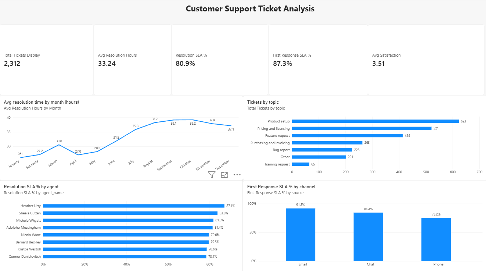
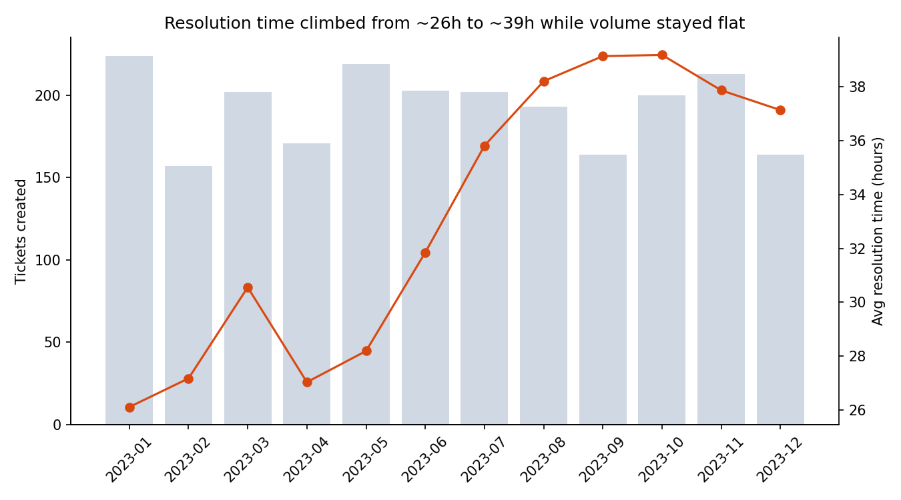
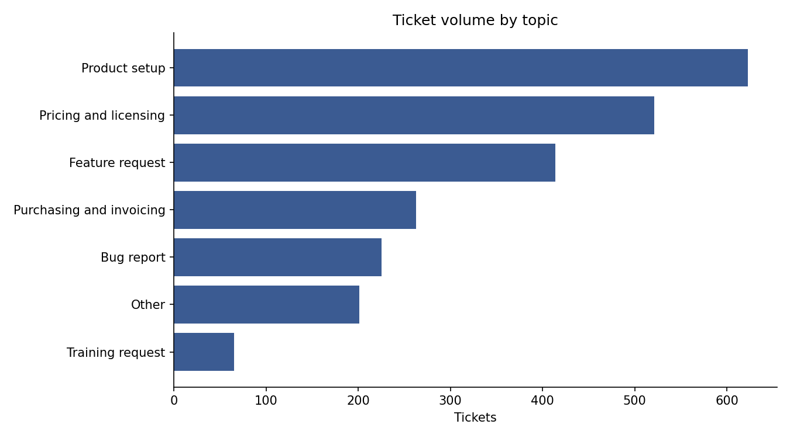
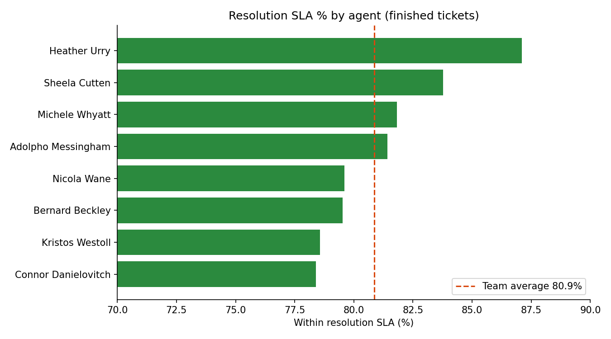
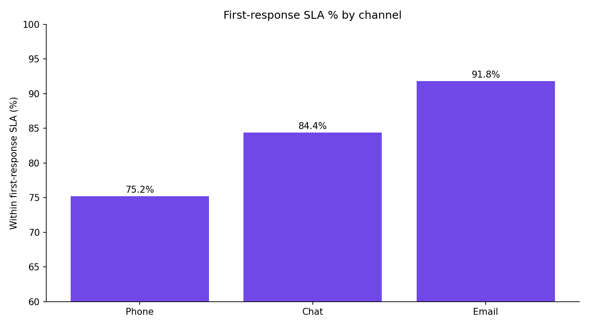

# Customer Support Ticket Analysis

An end-to-end analytics project on 2,312 customer support tickets (Jan-Dec 2023): raw CSV, cleaned in Python, modelled and queried in MySQL, charted with Matplotlib, and summarised in a Power BI dashboard.



## Business questions
- How quickly are tickets resolved, and is that changing over time?
- Are we meeting our SLAs (first response and resolution)?
- Which topics, agents and channels need attention?

## Tools
Python (Pandas, NumPy, Matplotlib) · MySQL / MySQL Workbench · Power BI · Git

## Key findings
- **Resolution time rose from about 26 hours (January) to about 39 hours (autumn)** while monthly ticket volume stayed roughly flat.
- **Resolution SLA is 80.9%** for finished tickets; **first-response SLA is 87.3%**.
- **Phone has the weakest first-response SLA (75.2%)**; email is the best (91.8%).
- **Training requests take longest to resolve (38.9 hrs on average)**; bug reports are fastest (29.9 hrs).
- **Agent results differ:** one agent has the highest customer rating (4.07 out of 5) but the lowest resolution SLA (78.4%) and the largest open backlog (72 tickets); another has the best SLA (87.1%) and the smallest backlog (22).
- Average customer satisfaction is **3.51 / 5** (1,173 surveys, closed tickets only).

## Project steps
1. **Cleaning (Python, `01_cleaning.py`)**: standardised column names, merged two spellings of one topic, trimmed text, converted 6 timestamp columns, derived first-response and resolution hours, flagged data-quality issues.
2. **Database (MySQL, `02_setup_tables.sql`)**: normalised into `agents`, `topics`, `statuses` and `tickets` tables with foreign keys, plus the view `v_ticket_report` for Power BI.
3. **Analysis (SQL, `03_queries.sql`)**: 15 queries using joins, `GROUP BY`/`HAVING`, `CASE`, a CTE, and window functions (`RANK`, `LAG`).
4. **Charts (Matplotlib, `04_charts.py`)**: monthly trend, topic volume, SLA by agent, first-response SLA by channel.
5. **Dashboard (Power BI, `support_dashboard.pbix`)**: 5 KPI cards and 4 charts, connected to the MySQL view.

## Dashboard KPIs
| KPI | Value |
|---|---|
| Total tickets | 2,312 |
| Average resolution time | 33.24 hours |
| Resolution SLA % (finished tickets) | 80.9% |
| First-response SLA % | 87.3% |
| Average customer satisfaction | 3.51 |

## Charts
| | |
|---|---|
|  |  |
|  |  |

## Data quality notes
- 400 tickets are still **In progress**; they have no resolution time and are **excluded from resolution SLA %** (counting them as "violated" would understate performance).
- 2 tickets had a first response timestamp **before** the ticket was created; the impossible value was blanked and flagged (`frt_data_issue`).
- 45 tickets show exactly 60 agent interactions while the next highest is 10; they are flagged (`interactions_outlier`) rather than deleted.
- Ticket IDs run from 1012 to 3999 but only 2,312 are present, so the dataset appears to be a sample.
- Survey scores exist only for closed tickets (1,173 of 2,312).
- The dataset has no cost field, so no cost analysis is included.

## Repository contents
```
01_cleaning.py          Python cleaning steps
02_setup_tables.sql     MySQL schema and loading (run once)
03_queries.sql          15 analysis queries + Power BI view
04_charts.py            Matplotlib charts
support_dashboard.pbix  Power BI dashboard
tickets_clean.csv       cleaned data
images/                 dashboard and chart images
```

## How to reproduce
1. Run `01_cleaning.py` on `tickets.csv` to produce `tickets_clean.csv`.
2. Import `tickets_clean.csv` into MySQL as `tickets_staging` (set `first_response_hours` to text so no rows are dropped), then run `02_setup_tables.sql`.
3. Run the queries in `03_queries.sql` and create the `v_ticket_report` view.
4. Open `support_dashboard.pbix` in Power BI and point it to your MySQL `support_db`.
